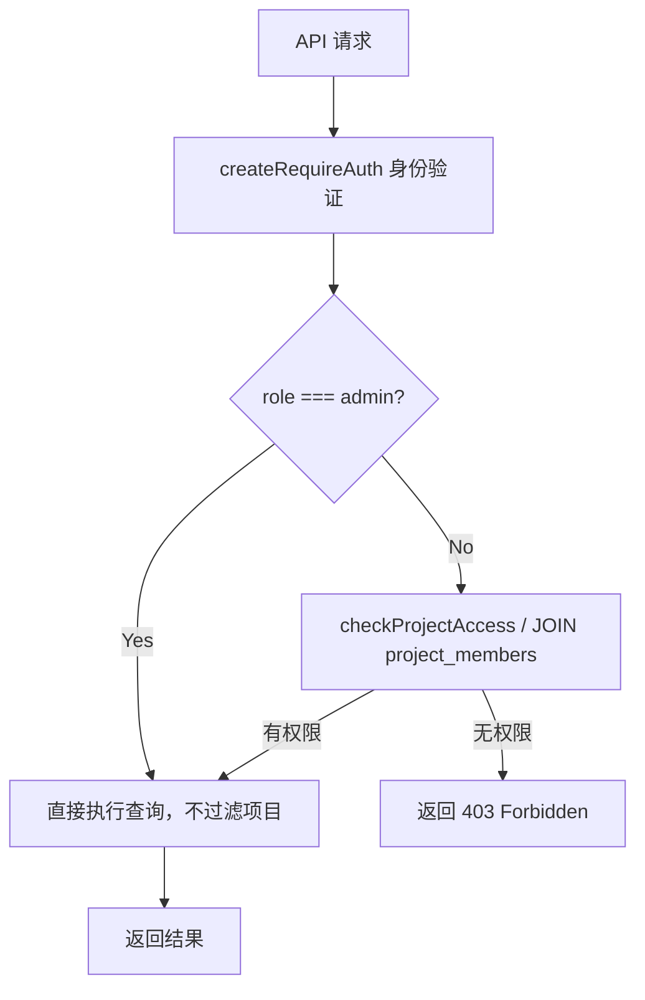

## 用户需求

修复 `packages/api` 中意见模块（observations）和船只模块（ships）存在的水平越权漏洞，使 API 层的权限控制与项目列表接口保持一致。

## 产品概述

系统已有基于 `project_members` 表的项目权限机制，但 observations 和 ships 两个路由模块未接入该机制，导致任意登录用户通过直接调用 API 可绕过前端访问控制，读取或修改未授权项目的数据。

## 核心修复范围

### 漏洞一：ships 路由缺少项目成员过滤（`GET /ships`）

- `admin` 可见所有船只，非 admin 用户仅返回其所属项目的船只
- `GET /ships/:id` 单条查询也需要校验用户对该船所属项目是否有权限

### 漏洞二：observations 路由全面缺少项目权限校验

以下接口均需补充：先查出目标资源归属的 projectId，再校验当前用户是否在 `project_members` 中（admin 角色跳过）：

- `GET /observations`（列表查询）
- `GET /observations/inspection-comments`（汇总查询）
- `GET /ships/:shipId/observations`（按船查询）
- `POST /ships/:shipId/observations`（新增）
- `POST /ships/:shipId/observations/batch`（批量导入）
- `GET /observations/:id`（单条读取）
- `PUT /observations/:id`（更新）
- `PUT /observations/:id/close`（关闭）

## 技术栈

- 现有栈：Hono + TypeScript + Cloudflare D1（SQLite）
- 权限模式：已有 `project_members` 表 JOIN 校验，已在 `projects.ts` 中实现，直接复用

## 实现思路

### 核心策略

复用 `projects.ts` 中已验证的 `project_members` 查询模式，在 D1 SQL 层面直接通过 JOIN 过滤数据，无需引入新的服务层或中间件，保持现有架构一致性。

**两种校验场景：**

1. **列表查询**：在 SQL 中增加 `INNER JOIN project_members` 条件，admin 跳过该 JOIN
2. **单资源操作**（写操作/按 ID 查询）：先查出资源所属 projectId，再查 project_members 校验，admin 跳过

### 新增共用工具函数

在 observations 路由内提取一个辅助函数 `checkProjectAccess(db, userId, role, projectId)`，封装以下逻辑：

- `admin` 直接返回 true
- 其他角色查 `project_members` 表，无记录则返回 403

这样 ships.ts 和 observations.ts 均可复用该函数，保持 DRY 原则。

### SQL 层过滤（列表接口）

对于列表接口，直接在 SQL 中补充 JOIN，效率最高，单次查询完成：

```sql
-- 非 admin 用户查 observations 列表
SELECT o.*, u."displayName" AS "authorName"
FROM "observations" o
LEFT JOIN "users" u ON u."id" = o."authorId"
INNER JOIN "ships" s ON s."id" = o."shipId"
INNER JOIN "project_members" pm ON pm."projectId" = s."projectId" AND pm."userId" = ?
WHERE 1=1
```

### 资源操作校验（写/单读接口）

对于 `PUT /observations/:id`、`POST /ships/:shipId/observations` 等，先通过一次查询获取 projectId，再调用 `checkProjectAccess`，失败时返回 403。

### 实现注意事项

- `admin` 角色判断统一在函数内处理，避免每个路由重复分支
- ships `GET /` 在有 `projectId` 参数时也需校验该 projectId 的成员关系，无 projectId 时按成员关系过滤所有可见船只
- 写操作（POST/PUT）只检查项目权限，**不额外限制专业（discipline）**，因用户要求仅修复越权漏洞，专业维度的权限控制不在本次修复范围内
- 保持所有现有接口的请求/响应格式不变，避免影响前端

## 目录结构

```
packages/api/src/routes/
├── observations.ts   # [MODIFY] 新增 checkProjectAccess 辅助函数；为所有8个接口补充项目权限校验
└── ships.ts          # [MODIFY] GET / 和 GET /:id 补充项目成员过滤
```

## 架构设计

