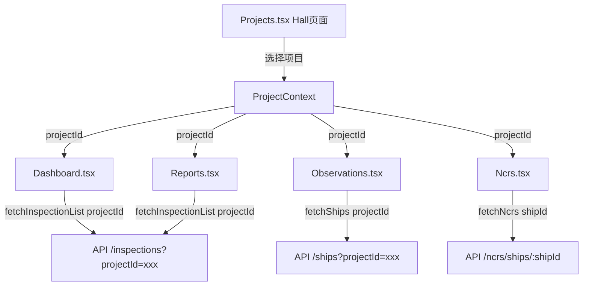

## 需求概述

当前系统存在权限隔离问题：admin用户在Hall页面选择项目后，Dashboard、Observations、NCRs、Reports页面仍然显示所有项目的船只数据，导致数据量过大且权限隔离不佳。

## 核心功能需求

1. **项目上下文状态管理**：创建全局状态保存当前选中的项目
2. **Hall页面改造**：点击项目卡片时，将项目ID存储到全局状态，并跳转到对应页面
3. **Dashboard页面过滤**：只显示当前选中项目下的船只检查项
4. **Observations页面**：已有项目选择功能，需与全局状态同步
5. **NCRs页面过滤**：根据选中项目加载船只和NCR数据
6. **Reports页面过滤**：统计和图表只显示当前项目数据

## 技术方案

### 架构设计

使用 **React Context + URL参数** 双重机制：

- **Context**：全局状态管理，保存当前选中项目
- **URL参数**：支持页面刷新后状态保持，支持分享链接



### 实现要点

1. **创建 ProjectContext**

- 存储 `selectedProjectId`
- 提供 `setSelectedProject` 方法
- 从 URL 参数初始化状态

2. **修改 API 层**

- `fetchInspectionList()` 增加 `projectId` 可选参数
- 后端 `/inspections` 路由增加 `projectId` 查询参数过滤

3. **各页面改造**

- Dashboard：根据 projectId 过滤船只列表，只显示该项目下的检查项
- NCRs：根据 projectId 加载船只列表，再加载对应NCR
- Reports：统计图表只计算当前项目数据
- Observations：与全局状态双向同步

### 数据流

```
用户选择项目 → ProjectContext 更新 → URL 更新 → 各页面监听 → API请求带projectId → 后端过滤返回
```

### 性能考虑

- 使用 `useMemo` 缓存过滤结果
- 项目切换时清除之前的数据，避免闪烁
- API请求使用 `projectId` 参数，减少传输数据量

## Agent Extensions

### SubAgent

- **code-explorer**
- Purpose: 深入探索项目结构，确认API路由实现细节、权限过滤逻辑、以及现有Context模式
- Expected outcome: 获取准确的代码结构信息，确保方案与现有架构一致��方案与现有架构一致