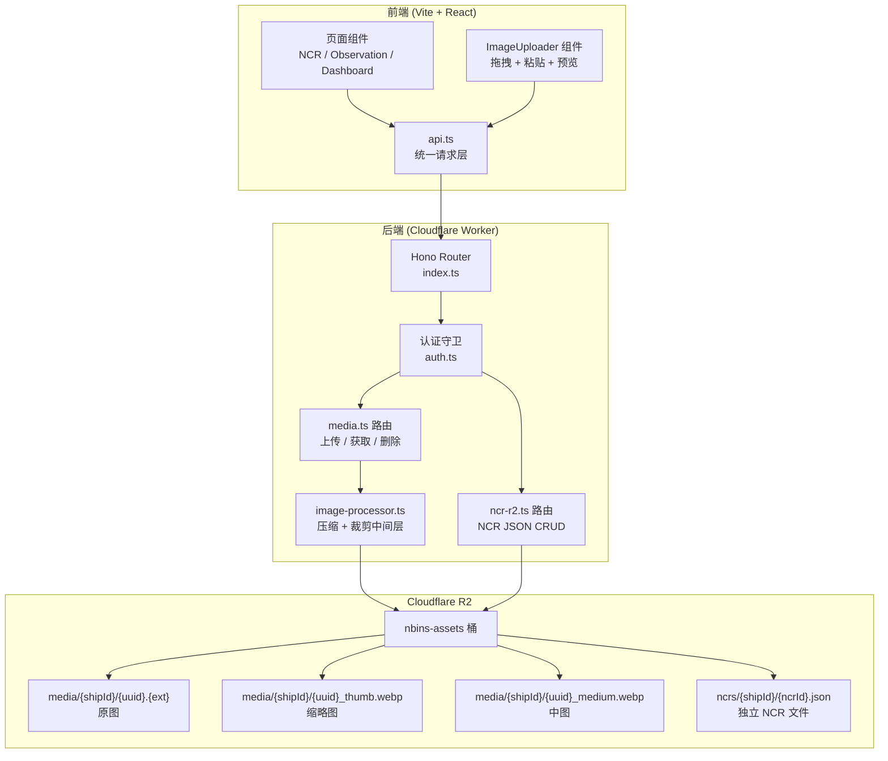

# 接入 Cloudflare R2 存储桶 — 图库 + NCR 迁移

## 背景

当前 NBINS 平台所有数据均存储在 Cloudflare D1 (SQL) 中。用户需要：
1. **图片存储**：建立统一图库，支持压缩与裁剪中间层，供报验意见 (Inspection Comments)、Observation、NCR 调用
2. **NCR 迁移**：将 NCR 数据从 D1 表迁移到 R2，以独立 JSON 文件形式按船号目录存储（`ncrs/{shipId}/{ncrId}.json`）
3. **授权复用**：继续使用现有的认证、项目/船号权限体系

## 已确认事项

1. **R2 存储桶名称**：`nbins-assets`
2. **图片尺寸规格**：
   - **缩略图 (thumb)**：240×240 px, JPEG 75% 质量
   - **中图 (medium)**：800×800 px, JPEG 80% 质量
   - **原图 (original)**：保持原始尺寸，但限制最大 5MB
3. **NCR 迁移策略**：只针对新产生的数据，D1 存量历史数据不进行自动迁移。
4. **前端图片上传交互**：支持 NCR、Observation、Inspection Comments，采用**拖拽模式**。

## 架构设计



## R2 存储结构

```
nbins-assets/
├── media/                          # 图库
│   └── {shipId}/
│       ├── {uuid}.webp             # 原图（压缩后）
│       ├── {uuid}_thumb.webp       # 缩略图 240x240
│       └── {uuid}_medium.webp      # 中图 800x800
│
└── ncrs/                           # NCR 数据库离线化存储
    └── {shipId}/
        └── {ncrId}.json            # 单个 NCR 的完整数据
```

### NCR JSON 文件结构

```json
{
  "shipId": "xxx",
  "updatedAt": "2026-04-12T14:30:00Z",
  "items": [
    {
      "id": "uuid",
      "title": "...",
      "content": "...",
      "authorId": "...",
      "status": "pending_approval",
      "approvedBy": null,
      "approvedAt": null,
      "attachments": ["media/shipId/uuid1.webp"],
      "createdAt": "...",
      "updatedAt": "..."
    }
  ]
}
```

## 实施计划

### 组件一：Wrangler 配置 + 环境类型

#### [MODIFY] [wrangler.jsonc](file:///d:/Code/nbins/packages/api/wrangler.jsonc)
- 新增 `r2_buckets` 配置绑定 `BUCKET`

#### [MODIFY] [env.ts](file:///d:/Code/nbins/packages/api/src/env.ts)
- `Bindings` 接口增加 `BUCKET?: R2Bucket`

---

### 组件二：图片处理中间层 (API)

#### [NEW] [image-processor.ts](file:///d:/Code/nbins/packages/api/src/services/image-processor.ts)
- 利用 Web API (`OffscreenCanvas` 或 `ImageBitmap`) 实现纯 Worker 环境下的图片压缩
- 实际考虑到 Workers 环境限制，使用 **转存原图 + 前端预处理** 的策略：前端在上传前通过 `<canvas>` 完成压缩/裁剪，后端只负责验证尺寸并生成 WebP 变体
- 输出三个规格：`original`、`medium`(800px)、`thumb`(240px)
- 使用 Cloudflare Image Resizing（如果账户开通了该功能）作为备选方案

> [!NOTE]
> Workers 运行时不支持 `<canvas>` 或 `sharp`。推荐方案为**前端压缩 + 后端转存**：前端使用 Canvas API 在浏览器中预压缩到 ≤2MB，后端接收 ArrayBuffer 直接写入 R2。缩略图可通过 Cloudflare 自带的 Image Resizing 或前端一并生成。

#### [NEW] [media.ts](file:///d:/Code/nbins/packages/api/src/routes/media.ts)
- `POST /api/media/upload` — 接收 `multipart/form-data`，含 `file` + `shipId` + `variant`(original/thumb/medium)
- `GET /api/media/:shipId/:filename` — 从 R2 读取并返回图片（带 `Cache-Control`）
- `DELETE /api/media/:shipId/:filename` — 删除图片（admin/manager 权限）
- `GET /api/media/:shipId` — 列出某船的所有图片
- 所有路由过 `requireAuth()` + 项目权限校验

---

### 组件三：NCR 迁移到 R2

#### [MODIFY] [ncrs.ts](file:///d:/Code/nbins/packages/api/src/routes/ncrs.ts)
- **重写全部路由**，读写操作改为 R2 独立 JSON 文件
- `GET /api/ncrs/ships/:shipId` → `R2.list({ prefix: "ncrs/{shipId}/" })` ⇾ 并发读取并聚合
- `POST /api/ncrs/ships/:shipId` → 直接写入新文件 `ncrs/{shipId}/{newId}.json`
- `PUT /api/ncrs/:id` → 直接覆盖对应文件，利用 D1 校验 version 实现逻辑锁（可选）
- 用户/项目权限校验逻辑保持不变（仍查 D1 的 `ships` 和 `users` 表）
- Webhook 触发逻辑保持不变

#### [MODIFY] [d1-bootstrap.sql](file:///d:/Code/nbins/packages/api/src/db/d1-bootstrap.sql)
- 保留 `ncrs` 表定义作为回退，但标记为废弃
- 或者完全移除 `ncrs` 表（在确认迁移完成后）

---

### 组件四：前端统一图片上传组件

#### [NEW] [ImageUploader.tsx](file:///d:/Code/nbins/packages/web/src/components/ImageUploader.tsx)
- 支持拖拽、点击选择、剪贴板粘贴
- 前端 Canvas 压缩（target ≤ 2MB, WebP 格式）
- 生成 `thumb`（240px）和 `medium`（800px）预览
- 上传进度条
- 已上传图片网格预览 + 删除按钮
- Props: `shipId`, `existingImages: string[]`, `onImagesChange: (urls: string[]) => void`

#### [NEW] [ImageGallery.tsx](file:///d:/Code/nbins/packages/web/src/components/ImageGallery.tsx)
- 轻量级图片画廊组件，用于只读展示
- 点击放大模态框
- Props: `images: string[]`, `thumbSuffix?: string`

---

### 组件五：前端 API 客户端扩展

#### [MODIFY] [api.ts](file:///d:/Code/nbins/packages/web/src/api.ts)
- 新增 `uploadMedia(shipId, file, variant)` — 发送 `multipart/form-data`
- 新增 `listMedia(shipId)` — 获取图片列表
- 新增 `deleteMedia(shipId, filename)` — 删除图片
- NCR 的 API 调用保持兼容（后端路由路径不变）

---

### 组件六：前端页面集成

#### [MODIFY] [Ncrs.tsx](file:///d:/Code/nbins/packages/web/src/pages/Ncrs.tsx)
- 创建 NCR 表单中嵌入 `ImageUploader` 组件
- NCR 列表的每条记录展示附件缩略图
- 点击缩略图弹出 `ImageGallery` 浮层

#### [MODIFY] [Observations.tsx](file:///d:/Code/nbins/packages/web/src/pages/Observations.tsx)
- 新增/编辑 Observation 表单中嵌入 `ImageUploader`
- 表格列新增「附件」列，鼠标悬停显示缩略图预览

#### [MODIFY] [Dashboard.tsx](file:///d:/Code/nbins/packages/web/src/pages/Dashboard.tsx)
- 巡检提交表单中可附加图片作为意见附件
- 意见详情区域展示已附加的图片

---

### 组件七：Shared 类型更新

#### [MODIFY] [ncr.ts](file:///d:/Code/nbins/packages/shared/src/ncr.ts)
- `NcrItemResponse.attachments` 类型保持 `string[]`（存储 R2 路径）
- 确保与前端类型一致

#### [MODIFY] [index.ts](file:///d:/Code/nbins/packages/shared/src/index.ts)
- `ObservationItem` 新增 `attachments?: string[]` 字段
- `InspectionCommentView` 新增 `attachments?: string[]` 字段

---

## 实施顺序

```
Phase 1: 基础设施 (30 min)
  ├── wrangler.jsonc + env.ts 增加 R2 绑定
  ├── media.ts 路由（上传/获取/列表/删除）
  └── 本地测试 R2 读写

Phase 2: NCR 迁移 (45 min)
  ├── 重写 ncrs.ts 路由切换到 R2 JSON
  ├── 添加数据迁移脚本（从 D1 导出到 R2）
  └── 本地验证 NCR CRUD

Phase 3: 前端组件 (60 min)
  ├── ImageUploader 组件
  ├── ImageGallery 组件
  ├── api.ts 扩展
  └── 集成到 NCR / Observation / Dashboard

Phase 4: 验证 & 部署 (15 min)
  ├── TypeScript 编译检查
  ├── 端到端流程测试
  └── wrangler deploy
```

## 验证计划

### 自动化检验
- `npx tsc --noEmit` 通过编译
- `pnpm run dev` 前后端联调

### 手动验证
1. **图片上传流程**：在 Observation 表单中上传图片 → 验证 R2 存储 → 验证缩略图回显
2. **NCR 全流程**：创建 NCR → 附加图片 → 审批 → 验证 JSON 文件更新
3. **权限隔离**：非项目成员无法访问其他项目的图片/NCR
4. **Dashboard 集成**：巡检意见附加图片 → PDF 报告中验证图片引用
