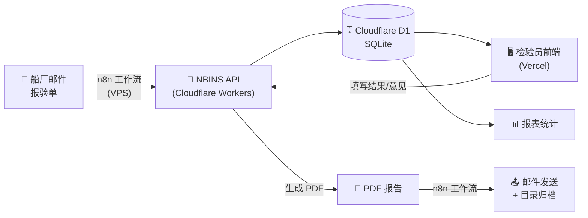
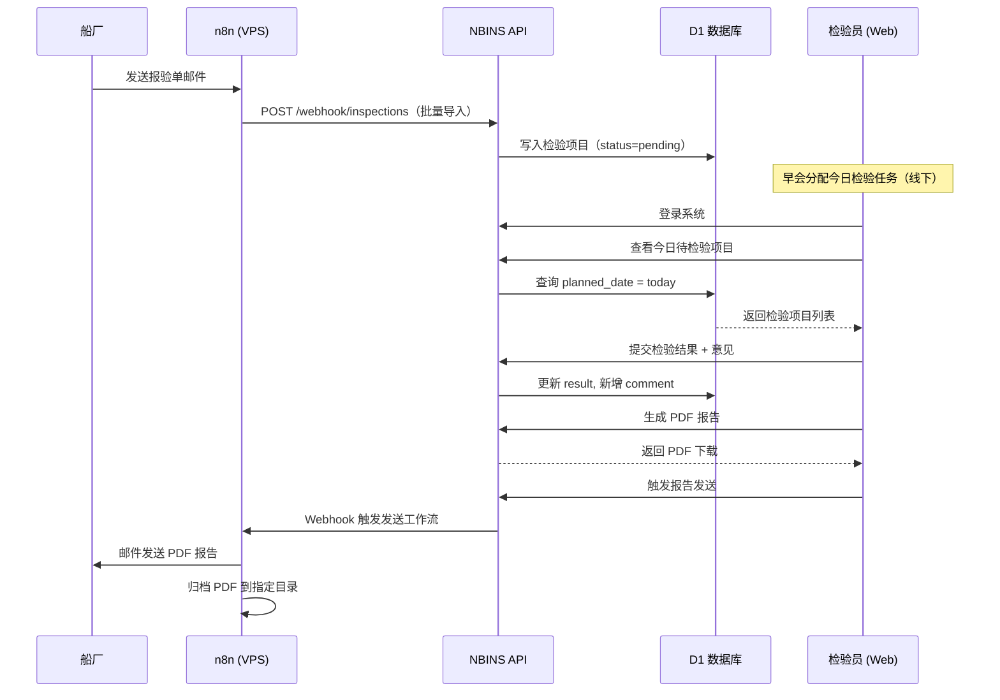
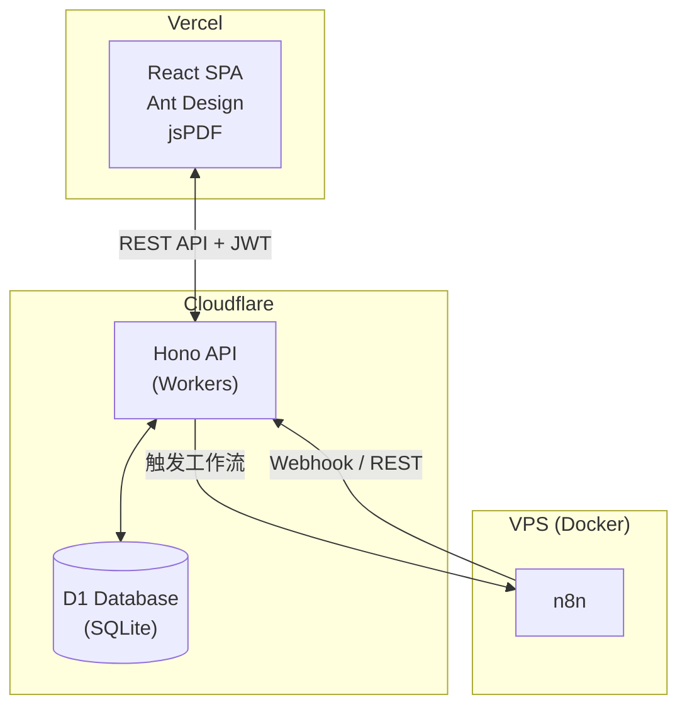
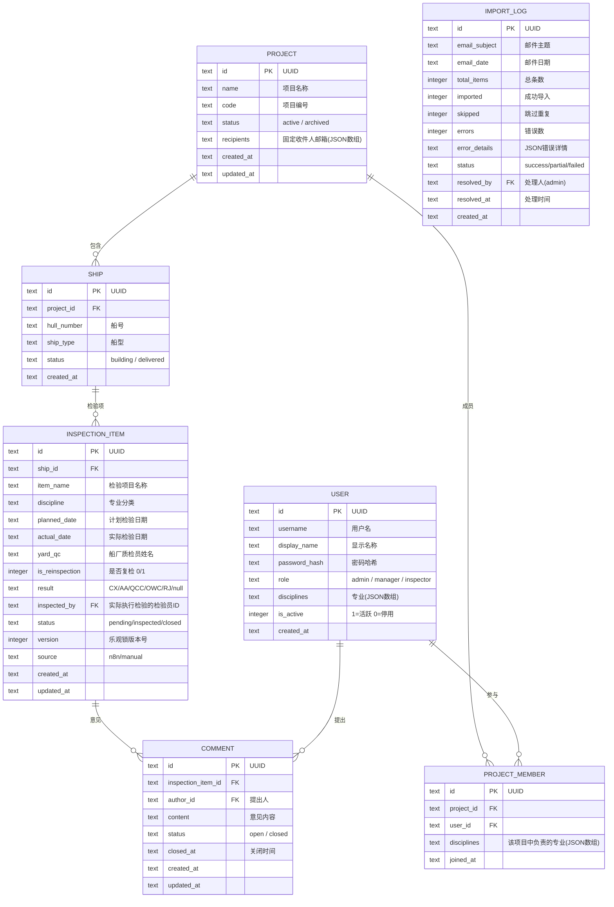
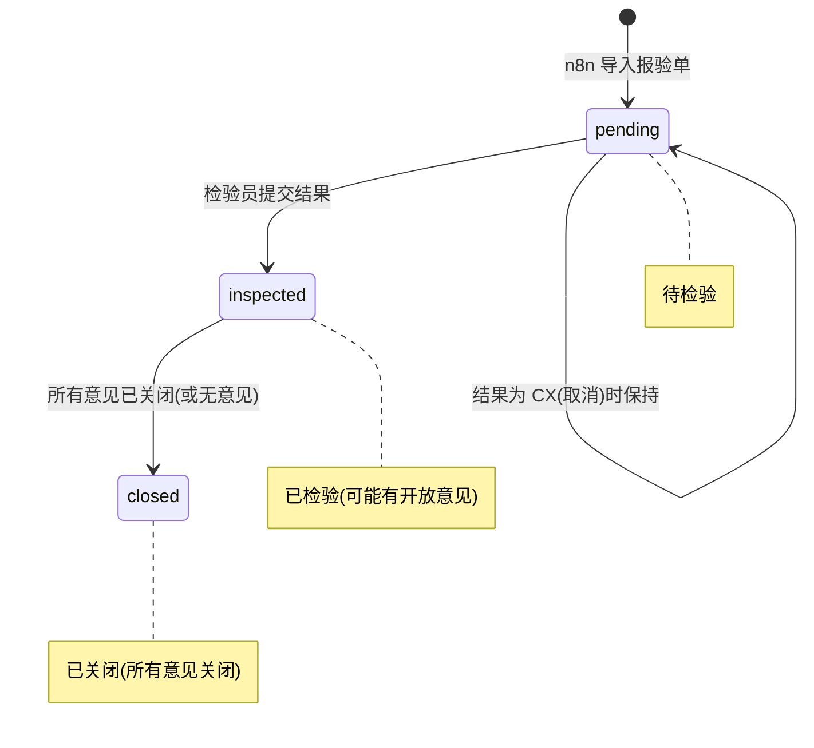
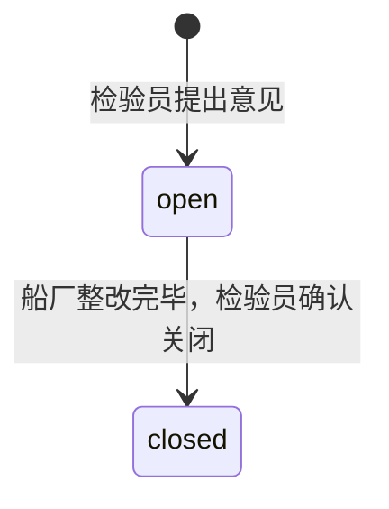

# NBINS - 新造船检验管理系统 架构设计 v3

> **项目名称**：NBINS（New Building Inspection System）
> **项目路径**：`d:\Code\nbins`
> **创建日期**：2026-04-02
> **状态**：架构设计完成，待审批

---

## 1. 系统概述

NBINS 是一个面向船舶检验机构的多人协作新造船检验管理平台。约 30 名检验员按 7 个专业分工，对约 10 个项目、每项目 10 条船、每船约 1000 项检验进行日常管理。

### 核心工作流



### 日常使用流程



---

## 2. 需求确认总结

| 维度 | 确认内容 |
|------|---------|
| **报验单字段** | 船号、检验项目名称、专业、日期、船厂质检员、是否复检 |
| **专业分类（7个）** | 船体(HULL)、舾装(OUTFIT)、轮机(ENGINE)、货物(CARGO)、电气(ELEC)、涂装(PAINT)、货围(CTNMT) |
| **检验结果（5种）** | CX(取消)、AA(接受)、QCC(带意见接受)、OWC(复检)、RJ(拒绝) |
| **意见状态** | 开放(open) / 关闭(closed)，一个检验项可有多条意见 |
| **流程** | 前一天/当天船厂提交报验 → 早会分配（线下）→ 当日检验 → 填写结果和意见 |
| **数据规模** | ~10 项目 × 10 船 × 1,000 项 = ~100,000 检验项 |
| **用户规模** | ~30 名检验员 |
| **角色** | 超级管理员(admin)、项目经理(manager)、检验员(inspector) |
| **权限** | 所有项目可查看；编辑需有对应专业权限；无审核流程 |
| **检验分配** | 早会线下分配，不在系统中追踪；检验员主动编辑自己负责的项目 |
| **质检员** | 报验单中的质检员是**船厂方**的质检人员 |
| **并发策略** | 乐观锁 + 专业权限约束；n8n 写入的基础数据检验员不可编辑 |
| **认证** | 用户名 + 密码 |
| **部署** | 前端 Vercel，API + DB 在 Cloudflare，n8n 在 VPS |
| **移动端** | 远期规划，当前仅 PC Web |
| **PDF** | 自行设计模板，包含项目名、船号、检验项目、日期、检验员、结果、意见、签名栏 |
| **附件** | 暂不支持图片上传 |

---

## 3. 技术架构

### 3.1 技术栈

| 层级 | 选型 | 理由 |
|------|------|------|
| **代码语言** | TypeScript (全栈) | 前后端统一，类型安全，共享类型定义 |
| **前端框架** | React 18 + Vite | 轻量快速，生态丰富 |
| **UI 组件库** | Ant Design 5 | 表格/表单功能强大，中文友好 |
| **前端部署** | Vercel | 用户指定，免费额度充足 |
| **API 框架** | Hono (TypeScript) | 专为 Cloudflare Workers 设计，类 Express |
| **API 部署** | Cloudflare Workers | 边缘计算，与 D1 原生绑定 |
| **数据库** | Cloudflare D1 (SQLite) | 用户指定，Serverless，免运维 |
| **ORM** | Drizzle ORM | 类型安全，原生支持 D1 |
| **认证** | JWT (jose 库) | 无状态，适合 serverless |
| **PDF 生成** | jsPDF (前端) | 浏览器端生成，无需服务器 |
| **状态管理** | Zustand | 轻量级 React 状态管理 |
| **n8n 集成** | REST API + Webhook | 通过 API 端点交互 |

### 3.2 架构图



---

## 4. 数据模型

### 4.1 ER 图



### 4.2 检验结果状态码

| 代码 | 英文 | 中文 | 说明 |
|------|------|------|------|
| `null` | — | 未检验 | 尚未填写结果 |
| `CX` | Cancel | 取消 | 检验取消 |
| `AA` | Accepted | 接受 | 检验通过 |
| `QCC` | QC Check | 带意见接受 | 通过但有意见需船厂整改确认 |
| `OWC` | Open With Comments | 复检 | 有开放意见，需要重新检验 |
| `RJ` | Rejected | 拒绝 | 检验不通过 |

### 4.3 状态流转

#### 检验项目状态 (`INSPECTION_ITEM.status`)



#### 意见状态 (`COMMENT.status`)



### 4.4 数据条目关系说明

> [!NOTE]
> **检验项目**（INSPECTION_ITEM）是主条目，对应报验单中的每一行——即一个具体的检验任务。
> **检验意见**（COMMENT）是子条目，挂在检验项目下。一个检验项目可以有 0 到多条意见，每条意见独立跟踪开闭状态。

### 4.5 权限模型 (RBAC)

| 角色 | 查看所有项目 | 编辑检验结果 | 管理意见 | 管理用户 | 管理项目 |
|------|:-----------:|:-----------:|:-------:|:-------:|:-------:|
| **admin** | ✅ | ✅ 所有专业 | ✅ | ✅ | ✅ |
| **manager** | ✅ | ✅ 所有专业 | ✅ | ❌ | ✅ |
| **inspector** | ✅ 查看 | ✅ 仅自己专业 | ✅ 仅自己专业 | ❌ | ❌ |

**编辑权限规则**：
1. 检验员只能编辑**自己专业范围内**的检验项
2. n8n 写入的基础数据（item_name, discipline, planned_date, yard_qc 等）检验员不可修改，仅 admin 可修改
3. 检验员可编辑的字段：`result`、`actual_date`、新增/管理 `COMMENT`
4. 提交结果时自动记录 `inspected_by` 为当前用户

### 4.6 并发控制：乐观锁

```sql
-- 更新检验结果时
UPDATE inspection_items
SET result = ?, actual_date = ?, inspected_by = ?,
    version = version + 1, updated_at = ?
WHERE id = ? AND version = ?

-- affected_rows = 0 → 版本冲突，提示用户刷新后重试
```

---

## 5. API 设计

### 5.1 认证

| 端点 | 方法 | 说明 | 权限 |
|------|------|------|------|
| `/api/auth/login` | POST | 登录，返回 JWT | 公开 |
| `/api/auth/me` | GET | 当前用户信息 | 已登录 |
| `/api/auth/change-password` | POST | 修改密码 | 已登录 |

### 5.2 项目与船舶

| 端点 | 方法 | 说明 | 权限 |
|------|------|------|------|
| `/api/projects` | GET | 项目列表 | 已登录 |
| `/api/projects/:id` | GET | 项目详情 | 已登录 |
| `/api/projects` | POST | 创建项目 | admin/manager |
| `/api/projects/:id` | PUT | 编辑项目 | admin/manager |
| `/api/projects/:id/members` | GET/POST/DELETE | 成员管理 | admin/manager |
| `/api/ships` | GET | 船舶列表（按项目筛选） | 已登录 |
| `/api/ships/:id` | GET | 船舶详情 | 已登录 |

### 5.3 检验项目

| 端点 | 方法 | 说明 | 权限 |
|------|------|------|------|
| `/api/inspections` | GET | 检验项目列表（多维筛选） | 已登录 |
| `/api/inspections/:id` | GET | 检验项详情（含意见列表） | 已登录 |
| `/api/inspections/:id/result` | PUT | 提交检验结果（乐观锁） | 对应专业 |
| `/api/inspections/:id/comments` | POST | 添加意见 | 对应专业 |
| `/api/comments/:id` | PUT | 编辑意见 | 作者本人 |
| `/api/comments/:id/close` | PUT | 关闭意见 | 对应专业 |

### 5.4 报表

| 端点 | 方法 | 说明 | 权限 |
|------|------|------|------|
| `/api/reports/pass-rate` | GET | 通过率统计 | 已登录 |
| `/api/reports/comments-list` | GET | 意见清单 | 已登录 |
| `/api/reports/daily-summary` | GET | 每日检验汇总 | 已登录 |
| `/api/reports/progress` | GET | 检验进度（远期） | 已登录 |

### 5.5 Webhook（n8n 集成）

| 端点 | 方法 | 说明 | 权限 |
|------|------|------|------|
| `/api/webhook/inspections` | POST | 批量导入检验项目 | API Key |
| `/api/webhook/send-report` | POST | 触发报告发送 | API Key |

### 5.6 导入日志（管理员异常处理）

| 端点 | 方法 | 说明 | 权限 |
|------|------|------|------|
| `/api/import-logs` | GET | 导入日志列表 | admin |
| `/api/import-logs/:id` | GET | 日志详情（含错误明细） | admin |
| `/api/import-logs/:id/resolve` | PUT | 标记已处理 | admin |
| `/api/import-logs/:id/retry` | POST | 重试导入失败的条目 | admin |

### 5.7 用户管理

| 端点 | 方法 | 说明 | 权限 |
|------|------|------|------|
| `/api/users` | GET | 用户列表 | admin |
| `/api/users` | POST | 创建用户 | admin |
| `/api/users/:id` | PUT | 编辑用户 | admin |
| `/api/users/:id` | DELETE | 停用用户 | admin |

---

## 6. 项目目录结构

```
d:\Code\nbins\
├── docs/                          # 📚 项目文档
│   ├── architecture.md            # 架构设计文档
│   ├── data-model.md              # 数据模型文档
│   ├── api-reference.md           # API 接口文档
│   ├── frontend-plan.md           # 前端设计文档
│   ├── n8n-plan.md                # n8n 工作流设计文档
│   ├── deployment.md              # 部署指南
│   └── handover/                  # AI Agent 交接文档
│       ├── CONTEXT.md             # 项目上下文概述
│       ├── CONVENTIONS.md         # 编码约定和规范
│       └── CHANGELOG.md           # 变更日志
│
├── packages/                      # Monorepo 结构
│   ├── shared/                    # 前后端共享
│   │   ├── src/
│   │   │   ├── types.ts           # 数据模型 TypeScript 类型
│   │   │   ├── constants.ts       # 枚举/常量
│   │   │   └── validators.ts      # Zod schema
│   │   └── package.json
│   │
│   ├── api/                       # Cloudflare Workers API
│   │   ├── src/
│   │   │   ├── index.ts           # Hono 入口
│   │   │   ├── routes/            # 路由模块
│   │   │   ├── middleware/        # 认证 + 权限中间件
│   │   │   ├── db/                # Drizzle schema + 迁移
│   │   │   └── services/          # 业务逻辑
│   │   ├── wrangler.toml
│   │   └── package.json
│   │
│   └── web/                       # React 前端
│       ├── src/
│       │   ├── components/        # 通用组件
│       │   ├── pages/             # 页面组件
│       │   ├── hooks/             # 自定义 Hooks
│       │   ├── services/          # API 调用
│       │   ├── store/             # Zustand 状态
│       │   └── utils/
│       ├── vercel.json
│       └── package.json
│
├── n8n/                           # n8n 工作流备份
│   ├── import-inspections.json
│   └── send-report.json
│
├── package.json                   # Monorepo 根
├── pnpm-workspace.yaml
├── tsconfig.base.json
└── README.md
```

---

## 7. 开发阶段

| 阶段 | 内容 | 交付物 |
|------|------|--------|
| **Phase 0** | ✅ 需求确认 + 架构设计 | 本文档 + 前端规划 + n8n 规划 |
| **Phase 1** | 项目骨架搭建 | Monorepo、D1 建表、Hono API 骨架、React 脚手架 |
| **Phase 2** | 认证系统 + 用户管理 | 登录、JWT、用户 CRUD、RBAC 中间件 |
| **Phase 3** | 核心业务 - 检验管理 | 项目/船舶/检验项 CRUD、结果填写（乐观锁）、意见开闭 |
| **Phase 4** | n8n 集成 - 数据导入 | Webhook 端点、n8n 报验单解析工作流 |
| **Phase 5** | PDF 报告生成 | 报告模板、jsPDF 生成、下载/预览 |
| **Phase 6** | 报表与统计 | 通过率、意见清单、多维筛选、导出 |
| **Phase 7** | n8n 集成 - 报告分发 | 邮件发送工作流、目录归档 |
| **Phase 8** | 文档完善 + 部署上线 | 交接文档、Vercel/Workers 部署、域名配置 |

---

## 8. 文档系统（AI Agent 交接）

`docs/handover/` 目录为 AI Agent 跨工具交接设计：

| 文件 | 用途 | 更新频率 |
|------|------|---------|
| `CONTEXT.md` | 项目背景、技术栈、部署方式、核心概念 | 架构变更时 |
| `CONVENTIONS.md` | 编码规范、命名约定、文件组织 | 初始化后少量更新 |
| `CHANGELOG.md` | 每次重要变更记录，含原因和影响 | 每次开发后 |

---

## 下一步

1. 请审阅本文档及同时生成的 **前端规划** 和 **n8n 工作流规划**
2. 确认无误后批准，我将开始 Phase 1 执行
