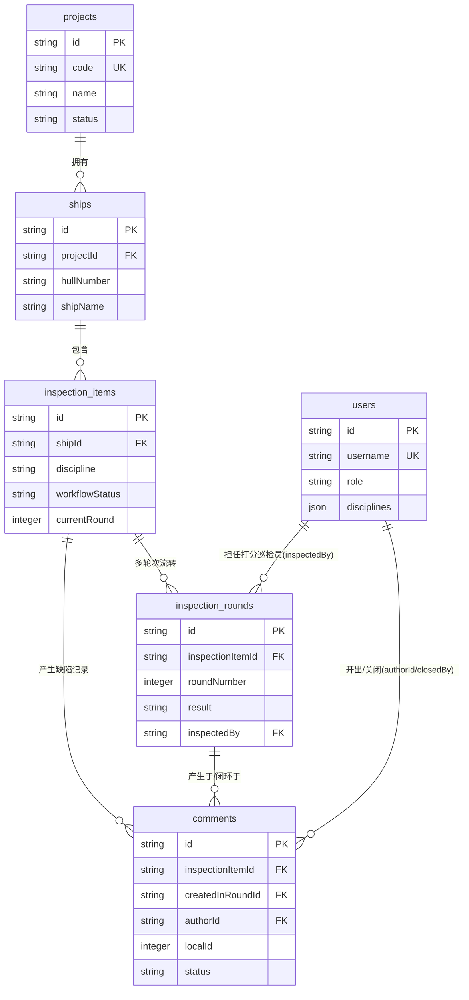

# NBINS 数据库结构文档 (D1 Database Schema)

本文档描述目前部署在 Cloudflare D1 中的核心底层数据表结构 (SQLite)。数据库结构使用代码即配置 (Schema-as-code) 的方式维护在 `packages/api/src/db/schema.ts` 中，通过 `pnpm d1:bootstrap` 自动生成对应的 DDL 语句并注入 D1 环境中。

## 核心实体关系图 (ER Diagram)

数据库采用了规范化的关系型设计，保证了数据的唯一性与追溯一致性，核心包含六张直接关联的大表：用户权限体系表、工程/船舶维度表以及检验事件状态流转表。

---

## 详细数据字典

### 1. `users` (用户与权限体系)
全局用户表，用于承载登录鉴权、以及针对不同检查专业 (Disciplines) 的展示权限管理。

| 字段名 | 类型 | 说明 | 外键约束 / 其他 |
| --- | --- | --- | --- |
| `id` | TEXT | 用户主键标识 | 主键 (PRIMARY KEY) |
| `username` | TEXT | 登录账号 | 唯一 (UNIQUE), NOT NULL |
| `displayName` | TEXT | 用于界面显示的真实姓名 | NOT NULL |
| `passwordHash` | TEXT | 哈希密码 | NOT NULL |
| `role` | TEXT | 基础角色属性 (admin, inspector等) | NOT NULL |
| `disciplines` | TEXT (JSON) | 用户所属/有权填写的专业列表 | 默认 `'[]'` |
| `isActive` | INTEGER | 是否还在职 / 启用该账号 | 1 启用 / 0 禁用 |
| `createdAt` | TEXT | 创建时间 (ISO8601) | NOT NULL |
| `updatedAt` | TEXT | 更新时间 (ISO8601) | NOT NULL |

### 2. `projects` (工程/项目主表)
公司承接的不同类型的系列大型船舶建造项目或检验项目包汇总。

| 字段名 | 类型 | 说明 | 外键约束 / 其他 |
| --- | --- | --- | --- |
| `id` | TEXT | 项目主键标识 | 主键 (PRIMARY KEY) |
| `name` | TEXT | 工程/项目全称 | NOT NULL |
| `code` | TEXT | 项目简写代号 (如 P-001) | 唯一 (UNIQUE), NOT NULL |
| `status` | TEXT | 项目状态 (active, archived) | 默认 'active' |
| `recipients` | TEXT (JSON) | 接收项目通报通知的默认对象列表 | 默认 `'[]'` |
| `createdAt` | TEXT | - | NOT NULL |
| `updatedAt` | TEXT | - | NOT NULL |

### 3. `ships` (船体/子项目)
挂在主项目下的每一个具体的交付船体对象或单只船舶实体。

| 字段名 | 类型 | 说明 | 外键约束 / 其他 |
| --- | --- | --- | --- |
| `id` | TEXT | 船只主键标识 | 主键 (PRIMARY KEY) |
| `projectId` | TEXT | 所属主项目 ID | FK `projects.id` |
| `hullNumber` | TEXT | 船壳编号 (极其重要检索号) | NOT NULL |
| `shipName` | TEXT | 交付船名 | NOT NULL |
| `shipType` | TEXT | 船种分类 | NULLABLE |
| `status` | TEXT | 建造状态 (building/delivered) | 默认 'building' |
| `createdAt` | TEXT | - | NOT NULL |
| `updatedAt` | TEXT | - | NOT NULL |

### 4. `inspection_items` (检查项主条目)
系统的核心表。当开始一项具体的检查或检验节点时，会产生一条独立的跟踪条目。

| 字段名 | 类型 | 说明 | 外键约束 / 其他 |
| --- | --- | --- | --- |
| `id` | TEXT | 检验条目总记录 ID | 主键 (PRIMARY KEY) |
| `shipId` | TEXT | 这是针对哪条船上的检查 | FK `ships.id` |
| `itemName` | TEXT | 检查主题标题名 | NOT NULL |
| `itemNameNormalized`| TEXT | 用于不区分大小写的标题搜索分词 | NOT NULL |
| `discipline` | TEXT | 属于哪个专业领域 (如 HULL, ELEC) | NOT NULL |
| `workflowStatus` | TEXT | 当前大状态 (pending, open, closed等) | 默认 'pending' |
| `lastRoundResult` | TEXT | 最新一轮产生的结果评级 (AA, QCC等)| NULLABLE |
| `resolvedResult` | TEXT | 如果关闭了，最终判定结果是什么 | NULLABLE |
| `currentRound` | INTEGER | 目前走到了第几轮复检 | 默认 1 |
| `openCommentsCount` | INTEGER | 目前尚有几条开放的整改意见挂起 | 默认 0 |
| `version` | INTEGER | D1 数据防冲突乐观锁并发控制版本号 | 默认 1 |
| `source` | TEXT | 来源渠道 (界面填表 manual 或 n8n 等) | NOT NULL |
| `createdAt` | TEXT | - | NOT NULL |
| `updatedAt` | TEXT | - | NOT NULL |

### 5. `inspection_rounds` (检验流转历史轮次)
因为某个巡检项可能会多次复检 (一轮不过测二轮)，这表负责快照下每一轮的具体打分反馈。

| 字段名 | 类型 | 说明 | 外键约束 / 其他 |
| --- | --- | --- | --- |
| `id` | TEXT | 本轮检验快照的主键 | 主键 (PRIMARY KEY) |
| `inspectionItemId`| TEXT | 挂靠于哪个主检验报告 | FK `inspection_items.id`|
| `roundNumber` | INTEGER | 这是对应的总体第几轮 | NOT NULL |
| `rawItemName` | TEXT | 填开这一轮时所记录的原始原标题快照 | NOT NULL |
| `plannedDate` | TEXT | 划定的预计检查日子 | NULLABLE |
| `actualDate` | TEXT | 该轮出结果的实际时间 | NULLABLE |
| `yardQc` | TEXT | 陪同受检 / 负责施工的代表厂检人员 | NULLABLE |
| `result` | TEXT | 本轮出具的结果评级 (如 OWC 待修) | NULLABLE |
| `inspectedBy` | TEXT | 是哪个账号执行查验确认的 (巡检员) | FK `users.id` |
| `notes` | TEXT | 本次随手记的小计补充说明 | NULLABLE |
| `source` | TEXT | 数据接入流 | NOT NULL |
| `createdAt` | TEXT | - | NOT NULL |
| `updatedAt` | TEXT | - | NOT NULL |

### 6. `comments` (缺陷 / 整改意见清单)
当打分为 `QCC`, `OWC`, `RJ` 等不理想状态时需要下发给承建施工队的缺陷条目，每一条对应一个 ID。

| 字段名 | 类型 | 说明 | 外键约束 / 其他 |
| --- | --- | --- | --- |
| `id` | TEXT | UUID 后端主键 | 主键 (PRIMARY KEY) |
| `inspectionItemId`| TEXT | 从属于哪个检查项大目录 | FK `inspection_items.id` |
| `createdInRoundId`| TEXT | 最开始是由该项检验的"第几轮历史记录"中首次开出来的 | FK `inspection_rounds.id`|
| `closedInRoundId` | TEXT | 终于在后续的哪"一轮复检中"确认销号关闭的 | FK `inspection_rounds.id` (NULLABLE) |
| `authorId` | TEXT | 谁开出这张缺陷单 | FK `users.id` |
| `localId` | INTEGER | 用于前端页面顺序展示的短序列号 (如缺陷 #1, #2) | NOT NULL, Default 0 |
| `content` | TEXT | 具体不达标情况整改指引的正文描述 | NOT NULL |
| `status` | TEXT | 整改意见的状态 (open 待修 / closed 搞定) | 默认 'open' |
| `closedBy` | TEXT | 确认该行完毕予以销户的人是谁 | FK `users.id` (NULLABLE) |
| `closedAt` | TEXT | 具体销户整改完毕的确定时间戳 | NULLABLE |
| `createdAt` | TEXT | 问题首发时间 | NOT NULL |
| `updatedAt` | TEXT | 最新状态变更时间 | NOT NULL |

---

## 防误操作建议

1. 开发环境重置或修改全表结构字段时，需直接更改 TypeScript 代码 `packages/api/src/db/schema.ts`，禁止通过修改手动生成的 SQL 试图绕过代码结构；
2. 由于存在乐观锁 `version` 字段校验，更新数据必须做 `WHERE id=? AND version=?` 来防止并发修改的覆写。
