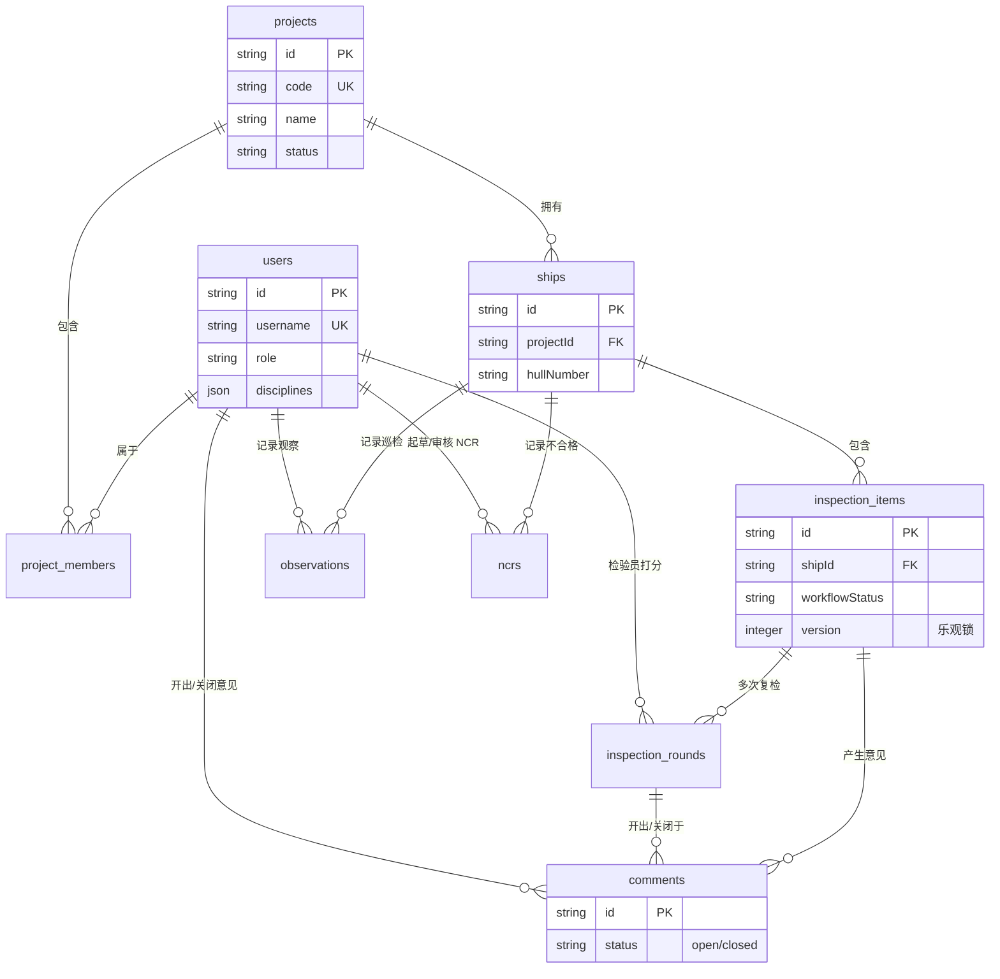

# NBINS 数据库结构文档 (D1 Database Schema)

本文档描述目前部署在 Cloudflare D1 中的核心底层数据表结构 (SQLite)。数据库结构使用代码即配置 (Schema-as-code) 的方式维护在 `packages/api/src/db/schema.ts` 中，通过 `pnpm d1:bootstrap` 自动生成对应的 DDL 语句并注入 D1 环境中。

## 1. 核心实体关系图 (ER Diagram)

数据库采用了规范化的关系型设计，支持检验业务的完整生命周期追踪。

---

## 2. 详细数据字典

### 2.1 `users` (用户与权限)
管理检验员、管理员的身份、角色、负责专业及项目权限。

| 字段名 | 类型 | 说明 | 约束 |
| :--- | :--- | :--- | :--- |
| `id` | TEXT | 用户主键标识 | PRIMARY KEY |
| `username` | TEXT | 登录账号 | UNIQUE |
| `displayName` | TEXT | 显示姓名 | - |
| `passwordHash` | TEXT | 密码哈希 | - |
| `role` | TEXT | 角色: `admin`, `manager`, `reviewer`, `inspector` | - |
| `disciplines` | TEXT (JSON) | 所属专业列表 (如 `HULL`, `ELEC`) | Default: `[]` |
| `accessibleProjectIds`| TEXT (JSON) | 允许访问的项目 ID 列表 | Default: `[]` |
| `isActive` | INTEGER | 1=启用, 0=禁用 | Default: 1 |
| `createdAt` / `updatedAt` | TEXT | 时间戳 | ISO8601 |

### 2.2 `projects` (工程/项目主表)
公司承接的大型造船项目或检验合同。

| 字段名 | 类型 | 说明 | 约束 |
| :--- | :--- | :--- | :--- |
| `id` | TEXT | 项目主键 | PRIMARY KEY |
| `name` | TEXT | 项目名称 | - |
| `code` | TEXT | 项目编号 (如 P-001) | UNIQUE |
| `status` | TEXT | `active` (活跃), `archived` (归档) | Default: `active` |
| `owner` | TEXT | 船东 | NULLABLE |
| `shipyard` | TEXT | 船厂 | NULLABLE |
| `class` | TEXT | 船级社 (ABS, DNV, CCS 等) | NULLABLE |
| `reportRecipients`| TEXT (JSON) | 报告固定收件人邮件列表 | Default: `[]` |
| `ncrRecipients` | TEXT (JSON) | NCR 固定收件人邮件列表 | Default: `[]` |

### 2.3 `ships` (具体船只)
项目下的具体交付单体。

| 字段名 | 类型 | 说明 | 约束 |
| :--- | :--- | :--- | :--- |
| `id` | TEXT | 船舶主键 | PRIMARY KEY |
| `projectId` | TEXT | 所属项目 | FK `projects.id` |
| `hullNumber` | TEXT | 船号 (如 S1101) | - |
| `shipName` | TEXT | 船名 | - |
| `status` | TEXT | `building` (建造中), `delivered` (已交付) | Default: `building` |

### 2.4 `inspection_items` (检验项目主条目)
系统的核心业务实体，追踪一个检验点的从报验到关闭的全生命周期。

| 字段名 | 类型 | 说明 | 约束 |
| :--- | :--- | :--- | :--- |
| `id` | TEXT | 记录主键 | PRIMARY KEY |
| `shipId` | TEXT | 关联船舶 | FK `ships.id` |
| `itemName` | TEXT | 原始报验名称 | - |
| `itemNameNormalized`| TEXT | 标准化名称 (用于自动复检匹配) | - |
| `discipline` | TEXT | 专业分类 | - |
| `workflowStatus` | TEXT | `pending`, `open`, `closed`, `cancelled` | Default: `pending` |
| `lastRoundResult` | TEXT | 最近一轮的结果评级 | NULLABLE |
| `resolvedResult` | TEXT | 最终结论 (AA) | NULLABLE |
| `currentRound` | INTEGER | 当前已进行的报验轮次 | Default: 1 |
| `openCommentsCount`| INTEGER | 冗余统计：当前开放意见数 | Default: 0 |
| `version` | INTEGER | **乐观锁版本号** | Default: 1 |
| `source` | TEXT | 来源: `manual`, `n8n` | - |

### 2.5 `inspection_rounds` (检验轮次快照)
记录每次报验（首检、复检）的具体现场情况。

| 字段名 | 类型 | 说明 | 约束 |
| :--- | :--- | :--- | :--- |
| `id` | TEXT | 轮次主键 | PRIMARY KEY |
| `inspectionItemId`| TEXT | 关联主检验项 | FK `inspection_items.id` |
| `roundNumber` | INTEGER | 轮次序号 (1, 2, 3...) | - |
| `plannedDate` | TEXT | 计划日期 | NULLABLE |
| `actualDate` | TEXT | 实际现场检验日期 | NULLABLE |
| `result` | TEXT | 本轮结果 (`AA`, `QCC`, `OWC`, `RJ`, `CX`) | NULLABLE |
| `inspectedBy` | TEXT | 执行查验的检验员 ID | FK `users.id` |
| `yardQc` | TEXT | 船厂质检员姓名 | NULLABLE |
| `notes` | TEXT | 现场备忘备注 | NULLABLE |

### 2.6 `comments` (缺陷整改意见)
当检验结果不完全通过时，随报验单下发的整改意见。

| 字段名 | 类型 | 说明 | 约束 |
| :--- | :--- | :--- | :--- |
| `id` | TEXT | 意见主键 | PRIMARY KEY |
| `inspectionItemId`| TEXT | 关联主检验项 | FK `inspection_items.id` |
| `createdInRoundId`| TEXT | 该意见在哪一轮产生的 | FK `inspection_rounds.id` |
| `closedInRoundId` | TEXT | 该意见在哪一轮被关闭的 | FK `inspection_rounds.id` |
| `authorId` | TEXT | 出具意见的检验员 | FK `users.id` |
| `localId` | INTEGER | 前端显示的短序号 (如 #1) | Default: 0 |
| `content` | TEXT | 意见正文内容 | - |
| `status` | TEXT | `open` (开启), `closed` (关闭) | Default: `open` |
| `closedBy` | TEXT | 关闭该意见的检验员 | FK `users.id` |
| `resolveRemark` | TEXT | 针对该问题的整改完成备注 | NULLABLE |

### 2.7 `observations` (巡检与试航意见)
用于记录非正式报验的现场发现（如试航、巡检）。

| 字段名 | 类型 | 说明 | 约束 |
| :--- | :--- | :--- | :--- |
| `id` | TEXT | 观察项主键 | PRIMARY KEY |
| `shipId` | TEXT | 关联船舶 | FK `ships.id` |
| `type` | TEXT | 类型 (如 `patrol`, `sea_trial`) | - |
| `discipline` | TEXT | 涉及专业 | - |
| `authorId` | TEXT | 记录人 | FK `users.id` |
| `date` | TEXT | 发现日期 | - |
| `content` | TEXT | 内容描述 | - |
| `status` | TEXT | `open`, `closed` | Default: `open` |

### 2.8 `ncrs` (不合格报告)
记录严重不合格项及其审核流程。

| 字段名 | 类型 | 说明 | 约束 |
| :--- | :--- | :--- | :--- |
| `id` | TEXT | NCR 主键 | PRIMARY KEY |
| `shipId` | TEXT | 船舶 ID | FK `ships.id` |
| `title` | TEXT | NCR 标题 | - |
| `content` | TEXT | NCR 正文内容 | - |
| `status` | TEXT | `draft`, `pending_approval`, `approved` | Default: `draft` |
| `approvedBy` | TEXT | 审批人 | FK `users.id` |
| `attachments` | TEXT (JSON) | 附件列表 | Default: `[]` |

---

## 3. 技术约束与并发设计

1.  **乐观锁控制**：所有对 `inspection_items` 的更新操作必须携带 `version` 字段。后端会执行 `UPDATE ... WHERE id = ? AND version = ?`，若影响行数为 0 则提示并发冲突。
2.  **软删除策略**：项目和用户通常不执行物理删除，而是通过 `status` (archived) 或 `isActive` (0) 进行软过滤。
3.  **JSON 存储**：对于动态性较强的列表数据（如专业列表、附件列表、邮件收件人），使用 SQLite 的 TEXT 类型存储 JSON 字符串。
4.  **ISO8601 时间戳**：所有日期字段统一使用 ISO8601 字符串格式 (`YYYY-MM-DDTHH:mm:ssZ`)，以便于前端处理和数据库字符串排序。
