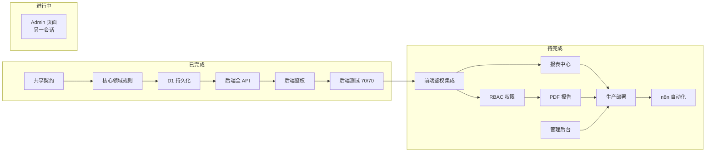
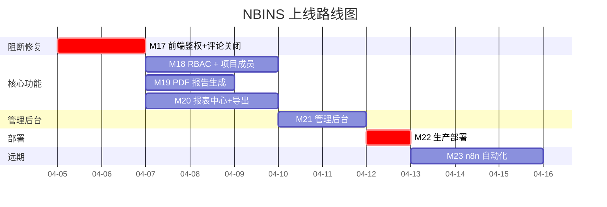

# NBINS 上线路线图 — 完整工作量评估

> 基准日期：2026-04-04
> 对标文档：[architecture.md](file:///d:/Code/nbins/docs/architecture.md) · [frontend-plan.md](file:///d:/Code/nbins/docs/frontend-plan.md) · [n8n-plan.md](file:///d:/Code/nbins/docs/n8n-plan.md)

---

## 总览：已完成 vs 待完成

---

## 逐模块完成度对照

### 后端 API（对照 architecture.md §5）

| API 端点 | 设计文档 | 代码状态 | 缺口 |
|----------|---------|---------|------|
| `POST /api/auth/login` | §5.1 | ✅ | — |
| `POST /api/auth/refresh` | §5.1 | ❌ | Refresh Token 机制 |
| `GET /api/auth/me` | §5.1 | ✅ | — |
| `POST /api/auth/change-password` | §5.1 | ❌ | 用户自主改密 |
| `GET/POST/PUT /api/projects` | §5.2 | ✅ | 缺 `members` 子路由 |
| `GET/POST/PUT /api/ships` | §5.2 | ✅ | — |
| `GET /api/inspections` | §5.3 | ✅ | 缺多维筛选参数 |
| `GET /api/inspections/:id` | §5.3 | ✅ | — |
| `PUT .../rounds/current/result` | §5.3 | ✅ | — |
| `PUT /api/inspections/batch-result` | §5.3 | ❌ | 批量提交 |
| `PUT .../comments/:id/resolve` | §5.3 | ✅ | — |
| `POST /api/inspections/:id/comments` | §5.3 | ❌ | 独立添加意见 |
| `GET/POST /api/comment-templates` | §5.3 | ❌ | 意见模板 |
| `POST /api/inspections/batch` | §5.4 | ✅ | — |
| `POST /api/inspections` (单条) | §5.4 | ❌ | 单条新增 |
| `GET/POST/PUT /api/observations` | §5.5 | ✅ | — |
| `GET/POST/PUT /api/observation-types` | §5.5 | ✅ | — |
| `GET /api/reports/*` (6个) | §5.6 | ❌ | **全部未实现** |
| `GET /api/exports/*` (4个) | §5.6 | ❌ | **全部未实现** |
| `POST /api/webhook/*` | §5.7 | ❌ | n8n webhook |
| `GET /api/import-logs` | §5.8 | ❌ | 导入日志 |
| `GET/POST/PUT/DELETE /api/users` | §5.9 | ✅ | — |
| `GET /api/audit-logs` | §5.10 | ❌ | 审计日志 |

**后端合计**：~24 个端点组已实现 14 组 (58%)，剩余 10 组 (42%)。

### 前端页面（对照 frontend-plan.md §3）

| 页面 | 设计文档 | 代码状态 | 缺口 |
|------|---------|---------|------|
| 登录 `/login` | §3.1 | 🟡 UI 完成 | 未对接 API / Token |
| 仪表盘 `/` | §3.2 | 🟡 与 Dashboard 合并 | 缺今日清单 PDF 导出 |
| 项目列表 `/projects` | §3.3 | ✅ | — |
| 项目详情 `/projects/:id` | §3.4 | ❌ | 船舶列表 + 成员 Tab |
| 检验项目列表 `/projects/:pid/ships/:sid` | §3.5 | 🟡 在 Dashboard | 缺批量快速填写模式 |
| 检验详情 `/inspections/:id` | §3.6 | 🟡 在 Dashboard 侧栏 | 缺 PDF 生成/下载/发送 + 评论关闭按钮 |
| 报表中心 `/reports` | §3.7 | ❌ 空壳 | **全部未实现** |
| 手动导入 `/import` | §3.12 | ✅ | — |
| 用户管理 `/admin/users` | §3.8 | 🔄 另一会话 | — |
| 项目管理 `/admin/projects` | §3.9 | ❌ | 创建/编辑/归档/成员 |
| 导入日志 `/admin/import-logs` | §3.10 | ❌ | 异常处理 |
| 意见模板 `/admin/comment-templates` | — | ❌ | 模板管理 |
| 巡检/试航意见 `/observations` | — | ✅ | — |

### 数据库表（对照 architecture.md §4.1）

| 表 | 代码状态 | 缺口 |
|----|---------|------|
| PROJECT | ✅ | — |
| SHIP | ✅ | — |
| USER | ✅ | 缺 `accessibleProjectIds` 的 PROJECT_MEMBER 正式化 |
| PROJECT_MEMBER | ❌ | **未建表**（当前用 User.accessibleProjectIds 简化） |
| INSPECTION_ITEM | ✅ | — |
| INSPECTION_ROUND | ✅ | — |
| COMMENT | ✅ | — |
| OBSERVATION | ✅ | — |
| OBSERVATION_TYPE | ✅ | — |
| IMPORT_LOG | ❌ | 未建表 |
| COMMENT_TEMPLATE | ❌ | 未建表 |
| AUDIT_LOG | ❌ | 未建表 |

---

## 工作包拆分

### M17 — 前端鉴权 + 评论关闭 UI

> 依赖：无 | 预估：1-2 会话 | 优先级：🔴 阻断

| # | 任务 | 涉及文件 |
|---|------|---------|
| 1 | 创建 `Admin.tsx` 临时空壳解除编译 | `pages/Admin.tsx` |
| 2 | 新建 `auth.ts` token 管理 (`localStorage`) | `web/src/auth.ts` |
| 3 | `api.ts` 注入 Bearer 头 + 401 拦截 | `web/src/api.ts` |
| 4 | `Login.tsx` 对接 `POST /api/auth/login` | `pages/Login.tsx` |
| 5 | `Layout.tsx` 路由守卫 | `components/Layout.tsx` |
| 6 | `TopBar.tsx` 显示用户 + 登出 | `components/TopBar.tsx` |
| 7 | `Dashboard.tsx` 评论关闭按钮 + 调用 `resolveInspectionComment` | `pages/Dashboard.tsx` |
| 8 | 提交 `api.ts` 未暂存变更 | `web/src/api.ts` |

验证：`pnpm qa` 全绿 + 手动登录→列表→关闭评论→登出流程。

---

### M18 — RBAC 权限中间件 + 项目成员模型

> 依赖：M17 | 预估：2-3 会话 | 优先级：🔴 上线必须

| # | 任务 | 说明 |
|---|------|------|
| 1 | 建 `PROJECT_MEMBER` 表 | schema + migration |
| 2 | 后端权限中间件 | 按角色+项目+专业过滤数据 |
| 3 | `POST /api/auth/refresh` | Refresh Token 静默续期 |
| 4 | `POST /api/auth/change-password` | 用户自主改密 |
| 5 | `GET /api/projects/:id/members` CRUD | 项目成员管理 |
| 6 | 检验列表查询加多维筛选 | `?discipline=&date_from=&status=` |
| 7 | 前端 `api.ts` 增加 refresh 拦截 | 静默续期 |
| 8 | 前端按角色隐藏/灰化操作按钮 | Dashboard + Observations |

验证：inspector 只看到允许的项目数据；manager 无法编辑非主管项目；admin 看全部。

---

### M19 — PDF 报告生成与下载（Puppeteer on VPS）

> 依赖：M17 | 预估：2-3 会话 | 优先级：🔴 上线必须
> 方案：VPS 上运行 Puppeteer 微服务（Docker），Workers API 通过 HTTP 代理调用。与远期 n8n 共享同一 VPS。

| # | 任务 | 说明 |
|---|------|------|
| 1 | VPS 搭建 Puppeteer PDF 微服务 | Docker + Express/Fastify + Puppeteer，暴露 `POST /render` 端点 |
| 2 | 设计 HTML/CSS 检验报告模板 | 项目名、船号、检验项目、日期、检验员、结果、意见表格、签名栏 |
| 3 | 设计 HTML/CSS 今日清单模板 | 按船/专业分组的待检列表，空白结果栏供手写 |
| 4 | Workers 代理路由 `GET /api/inspections/:id/report` | 查询数据 → 传给 VPS 渲染 → 返回 PDF 流 |
| 5 | Workers 代理路由 `GET /api/reports/today-checklist` | 今日清单 PDF |
| 6 | Dashboard 检验详情增加「生成报告」「下载 PDF」按钮 | 前端集成 |
| 7 | MVP 邮件发送：`mailto:` 链接引导 | 自动填充收件人+主题 |

验证：下载的 PDF 含完整中文检验数据、意见列表、签名栏；今日清单可打印。

---

### M20 — 报表中心 + 数据导出

> 依赖：M17 | 预估：2-3 会话 | 优先级：🔴 上线必须
> Excel 导出方案：浏览器侧使用 `xlsx`（SheetJS）库在前端生成并下载，后端仅提供 JSON 数据。

| # | 任务 | 说明 |
|---|------|------|
| 1 | 后端报表 API (6 个端点) | pass-rate, comments-list, observations-list, open-items, daily-summary, today-checklist |
| 2 | 前端 `/reports` 页面重写 | Tab: 通过率统计 / 意见清单 / 每日汇总 |
| 3 | 图表组件 | 饼图(结果分布) + 柱状图(按专业通过率) |
| 4 | 多维筛选 | 项目/船舶/专业/日期范围联动 |
| 5 | 前端 Excel/CSV 导出 | 使用 `xlsx` 库在浏览器侧将报表 JSON 转为 Excel 并触发下载 |
| 6 | 全量备份导出 | `GET /api/exports/full-backup` (JSON)，仅 admin |

验证：报表数据与 Dashboard 数据一致；导出的 Excel 可用 Office 打开。

---

### M21 — 管理后台

> 依赖：M17, M18 | 预估：2 会话 | 优先级：🟡 上线必须

| # | 任务 | 说明 |
|---|------|------|
| 1 | 用户管理页 `/admin/users` | **由另一会话编写** |
| 2 | 项目管理页 `/admin/projects` | 创建/编辑/归档 + 成员分配 + 收件人配置 |
| 3 | 导入日志页 `/admin/import-logs` | 后端 IMPORT_LOG 表 + CRUD + 前端展示 |
| 4 | 意见模板管理 `/admin/comment-templates` | 后端 COMMENT_TEMPLATE 表 + CRUD + 前端 |
| 5 | AUDIT_LOG 写入埋点 | 所有关键操作写审计日志 |
| 6 | 批量快速填写模式 | 列表页内联编辑 + `PUT /api/inspections/batch-result` |

验证：admin 可管理用户/项目/模板；导入异常可查看并标记处理。

---

### M22 — 生产部署

> 依赖：M17-M21 | 预估：1-2 会话 | 优先级：🔴 上线必须

| # | 任务 | 说明 |
|---|------|------|
| 1 | VPS 部署 PDF 微服务 | Docker Compose (Puppeteer)，与 M19 联合验证 |
| 2 | Cloudflare Workers 部署 | `wrangler deploy` + D1 binding + JWT_SECRET + PDF 微服务 URL |
| 3 | D1 生产数据库初始化 | schema bootstrap + 种子管理员用户 |
| 4 | Vercel 前端部署 | `VITE_NBINS_API_BASE_URL` 配置 |
| 5 | CORS 生产域名配置 | 替换 localhost 为生产域名 |
| 6 | D1 容量监控 | 定期检查用量 |
| 7 | 冒烟测试 | 端到端登录→检验→PDF→报表 |

验证：生产环境可正常登录、操作、生成报告、下载 PDF。

---

### M23 — n8n 自动化集成（远期）

> 依赖：M22 | 预估：2-3 会话 | 优先级：⚪ 远期

| # | 任务 | 说明 |
|---|------|------|
| 1 | `POST /api/webhook/inspections` 端点 | API Key 认证 |
| 2 | `POST /api/webhook/send-report` 端点 | 触发报告发送 |
| 3 | n8n WF-1: 报验单邮件 → 解析 → API | IMAP + Excel 解析 |
| 4 | n8n WF-2: PDF 报告 → 邮件 + OneDrive | Webhook + SMTP + OneDrive |
| 5 | IMPORT_LOG 写入集成 | n8n 导入结果回写 |

---

## 依赖关系与推荐执行顺序

> [!IMPORTANT]
> **上线必须集合 = M17 + M18 + M19 + M20 + M21 + M22**（全部核心功能 + 部署），预估总计 **11-15 个会话**。
> M23 (n8n 自动化) 明确为远期，上线后按需推进。
> 无硬性 deadline，按质量优先节奏推进。

---

## 已确认的设计决策

| 决策项 | 结论 |
|--------|------|
| PDF 生成方案 | **Puppeteer on VPS**（Docker），Workers 通过 HTTP 代理调用，HTML/CSS 模板排版 |
| Excel 导出方案 | **浏览器侧**使用 `xlsx`（SheetJS）库生成下载 |
| RBAC 优先级 | **必须同步上线**，不接受简化方案 |
| 上线时间 | 无硬性 deadline，质量优先 |
| Token 存储 | `localStorage`（船检员长时间工作场景） |
| Admin 页面 | 由另一个会话编写，本路线图仅创建临时空壳 |
