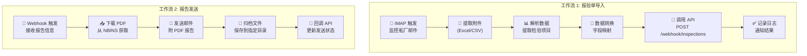
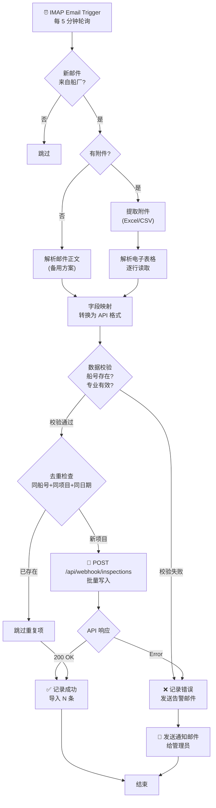
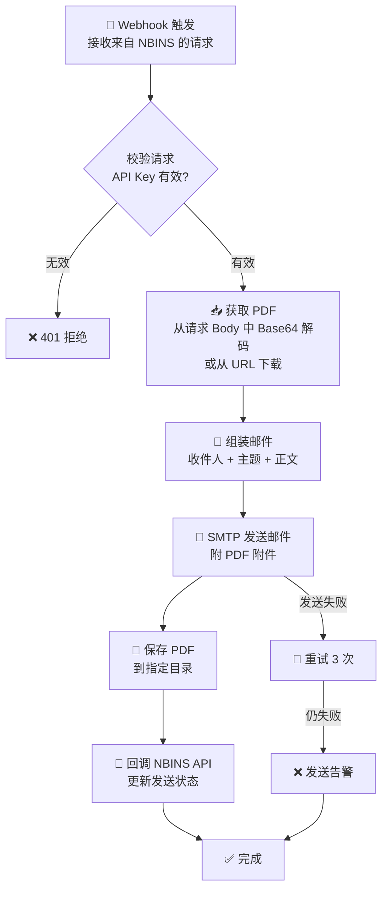

# NBINS - n8n 工作流设计规划

> **关联文档**：[架构设计](file:///C:/Users/Xing/.gemini/antigravity/brain/363e16d8-f32e-4186-a136-e5c65c50c3f9/implementation_plan.md)
> **n8n 部署位置**：VPS (Docker)
> **集成方式**：通过 NBINS API (Cloudflare Workers) 进行数据交互

---

## 1. 工作流总览

| 工作流 | 触发方式 | 方向 | 功能 |
|--------|---------|------|------|
| **WF-1** 报验单导入 | IMAP 邮件触发（定时轮询） | 船厂 → NBINS | 解析邮件中的报验单，提取检验项目，写入数据库 |
| **WF-2** 报告发送 | Webhook 触发（NBINS API 调用） | NBINS → 船厂 | 将 PDF 检验报告通过邮件发送给船厂，并归档 |



---

## 2. 工作流 1：报验单邮件解析导入

### 2.1 流程图



### 2.2 节点设计

#### 节点 1: IMAP Email Trigger

| 配置项 | 值 | 说明 |
|--------|---|------|
| 邮箱类型 | IMAP | 通用协议，兼容性最好 |
| 轮询间隔 | 5 分钟 | 平衡实时性和资源消耗 |
| 邮箱地址 | `inspection@your-domain.com` | 专用收件邮箱 |
| 过滤条件 | 发件人域名 = 船厂邮箱域名 | 只处理船厂邮件 |
| 标记已读 | 是 | 避免重复处理 |

> [!TIP]
> 建议设置一个专用邮箱接收报验单，避免混入其他邮件。可在邮件服务器设置转发规则，将船厂的报验单邮件自动转发到此邮箱。

#### 节点 2: 附件提取

```
IF 附件扩展名 IN [.xlsx, .xls, .csv]
  → 提取附件内容
ELSE IF 无附件
  → 尝试解析邮件正文（HTML 表格）
ELSE
  → 记录错误，发送告警
```

#### 节点 3: Excel 解析

使用 n8n 的 **Spreadsheet File** 节点读取 Excel。

> [!NOTE]
> 报验单为**英文列名**的 Excel 文件，一封邮件可包含**多条船**的检验项目。格式已与船厂约定。

**报验单表格结构（已确认）**：

| 列 | 示例值 | 映射到 API 字段 |
|----|--------|---------------|
| Hull No. | H-2748 | `hull_number` |
| Inspection Item | Main Engine Alignment | `item_name` |
| Discipline | ENGINE | `discipline` |
| Date | 2026-04-02 | `planned_date` |
| QC Inspector | Zhang San | `yard_qc` |
| Re-inspection | Y/N | `is_reinspection` |

#### 节点 4: 字段映射与转换

```javascript
// n8n Function 节点代码示例
const DISCIPLINE_MAP = {
  '船体': 'HULL',    'hull': 'HULL',
  '舾装': 'OUTFIT',  'outfit': 'OUTFIT',
  '轮机': 'ENGINE',  'engine': 'ENGINE',
  '货物': 'CARGO',   'cargo': 'CARGO',
  '电气': 'ELEC',    'electrical': 'ELEC',
  '涂装': 'PAINT',   'paint': 'PAINT',
  '货围': 'CTNMT',   'containment': 'CTNMT',
};

const items = $input.all();
const mapped = items.map(item => {
  const raw = item.json;
  const discipline = raw['专业'] || raw['Discipline'] || '';
  
  return {
    hull_number: (raw['船号'] || raw['Hull No.'] || '').trim(),
    item_name: (raw['检验项目'] || raw['Inspection Item'] || '').trim(),
    discipline: DISCIPLINE_MAP[discipline.toLowerCase()] || discipline,
    planned_date: formatDate(raw['日期'] || raw['Date']),
    yard_qc: (raw['质检员'] || raw['QC Inspector'] || '').trim(),
    is_reinspection: ['是', 'Y', 'Yes', '1'].includes(
      String(raw['复检'] || raw['Re-inspection'] || '').trim()
    ),
  };
});

return mapped.filter(m => m.hull_number && m.item_name);
```

#### 节点 5: 数据校验

```javascript
// 校验规则
const VALID_DISCIPLINES = ['HULL','OUTFIT','ENGINE','CARGO','ELEC','PAINT','CTNMT'];

const errors = [];
const valid = [];

for (const item of items) {
  if (!VALID_DISCIPLINES.includes(item.discipline)) {
    errors.push({ ...item, error: `未知专业: ${item.discipline}` });
    continue;
  }
  if (!item.planned_date.match(/^\d{4}-\d{2}-\d{2}$/)) {
    errors.push({ ...item, error: `日期格式错误: ${item.planned_date}` });
    continue;
  }
  valid.push(item);
}
```

#### 节点 6: 调用 NBINS API

**HTTP Request 节点配置**：

| 配置项 | 值 |
|--------|---|
| 方法 | POST |
| URL | `https://nbins-api.your-domain.workers.dev/api/webhook/inspections` |
| 认证 | Header Auth: `X-API-Key: <webhook_secret>` |
| Body 类型 | JSON |

**请求体**：
```json
{
  "source": "n8n_email",
  "email_subject": "报验单 - H-2748 - 2026-04-02",
  "email_date": "2026-04-02T08:00:00Z",
  "items": [
    {
      "hull_number": "H-2748",
      "item_name": "主机安装对中",
      "discipline": "ENGINE",
      "planned_date": "2026-04-02",
      "yard_qc": "张三",
      "is_reinspection": false
    }
  ]
}
```

**API 响应**：
```json
{
  "success": true,
  "imported": 15,
  "skipped": 2,
  "errors": [],
  "message": "成功导入 15 条检验项目，跳过 2 条重复项"
}
```

### 2.3 去重策略

API 端会根据以下组合判断重复：
```
hull_number + item_name + discipline + planned_date
```
如果组合已存在，跳过该条（不覆盖已有数据）。

### 2.4 异常处理

| 异常场景 | 处理方式 |
|---------|---------|
| 邮件无附件、无表格 | 记录日志，发送告警邮件给管理员 |
| Excel 格式无法解析 | 保存原始文件，发送告警 |
| 字段缺失（无船号/无专业） | 跳过该行，汇总错误 |
| 未知专业名称 | 跳过该行，记录错误 |
| 船号在系统中不存在 | 记录错误，可能需要先在系统中创建船舶 |
| API 调用失败 | 重试 3 次，间隔 30 秒；失败后发送告警 |
| 网络超时 | 重试机制 + 告警 |

---

## 3. 工作流 2：检验报告邮件发送

### 3.1 流程图



### 3.2 Webhook 触发

**由 NBINS 前端触发**：检验员在检验详情页点击"发送报告"按钮 → NBINS API 调用此 Webhook。

**Webhook 请求体**：
```json
{
  "inspection_id": "uuid-xxx",
  "report": {
    "project_name": "项目 A",
    "hull_number": "H-2748",
    "item_name": "主机安装对中",
    "discipline": "ENGINE",
    "planned_date": "2026-04-02",
    "actual_date": "2026-04-02",
    "yard_qc": "张三",
    "inspector": "李四",
    "result": "QCC",
    "result_text": "带意见接受",
    "comments": [
      { "content": "面漆厚度不足...", "status": "open", "date": "2026-04-02" }
    ]
  },
  "pdf_base64": "JVBERi0xLjQK...",
  "recipients": ["shipyard-qc@example.com"],
  "cc": ["manager@our-company.com"],
  "archive_path": "/reports/2026/04/H-2748/"
}
```

### 3.3 邮件模板

**主题**：
```
[NBINS] 检验报告 - {hull_number} - {item_name} - {result_text} - {date}
```

**正文**（HTML）：
```html
<h2>检验报告通知</h2>
<table>
  <tr><td>项目:</td><td>{project_name}</td></tr>
  <tr><td>船号:</td><td>{hull_number}</td></tr>
  <tr><td>检验项目:</td><td>{item_name}</td></tr>
  <tr><td>专业:</td><td>{discipline}</td></tr>
  <tr><td>检验日期:</td><td>{actual_date}</td></tr>
  <tr><td>检验结果:</td><td><b>{result_text}</b></td></tr>
</table>
<p>详细检验报告请见附件 PDF。</p>
<hr>
<p style="color: gray;">此邮件由 NBINS 检验管理系统自动发送。</p>
```

**附件**：`{hull_number}_{item_name}_{date}.pdf`

### 3.4 文件归档（OneDrive）

通过 **OneDrive API** 将 PDF 归档到云端，按目录结构组织：

```
OneDrive:/NBINS-Reports/
├── 2026/
│   ├── 04/
│   │   ├── H-2748/
│   │   │   ├── H-2748_Main_Engine_Alignment_2026-04-02.pdf
│   │   │   ├── H-2748_Pipe_System_Test_2026-04-02.pdf
│   │   │   └── ...
│   │   └── H-2749/
│   │       └── ...
│   └── 03/
│       └── ...
```

使用 n8n 的 **Microsoft OneDrive** 节点（OAuth2 认证）上传 PDF 文件。

> [!NOTE]
> n8n 内置 OneDrive 节点，支持 OAuth2 认证。首次配置时需在 Azure AD 中注册应用并授权。

### 3.5 异常处理

> [!TIP]
> 异常数据不仅记录日志，还会写入数据库的 `IMPORT_LOG` 表，管理员可在**前端管理页面**中查看和手动处理导入异常。

| 异常场景 | 处理方式 |
| PDF 数据损坏 | 记录错误，回调 API 标记失败 |
| SMTP 发送失败 | 重试 3 次，间隔 1 分钟 |
| 收件人地址无效 | 记录错误，通知管理员 |
| OneDrive 上传失败 | 重试 3 次，失败后保存到 VPS 临时目录 + 告警 |
| 回调 API 失败 | 仅记录日志，不影响邮件发送 |

---

## 4. 安全与认证

### 4.1 n8n → NBINS API 认证

使用 **API Key** 认证，不使用用户 JWT（n8n 是系统级调用）：

```
Header: X-API-Key: <WEBHOOK_API_KEY>
```

- API Key 存储在 n8n 的 Credential 中
- NBINS API 的 webhook 路由验证此 Key
- 建议定期轮换 Key

### 4.2 NBINS API → n8n Webhook 认证

n8n Webhook 节点配置认证：

```
Header Auth:
  Header Name: X-Webhook-Secret
  Header Value: <WEBHOOK_SECRET>
```

---

## 5. 监控与日志

### 5.1 n8n 执行日志

n8n 自带执行历史，可查看每次工作流的：
- 执行时间、持续时间
- 每个节点的输入/输出数据
- 错误信息和堆栈

### 5.2 建议的告警渠道

| 方式 | 场景 | 说明 |
|------|------|------|
| 邮件通知 | 导入失败、发送失败 | 发送给管理员邮箱 |
| n8n 错误工作流 | 任何工作流错误 | n8n 内置的 Error Workflow 机制 |

---

## 6. 已确认项

| 项目 | 确认内容 |
|------|---------|
| **报验单格式** | Excel 附件，英文列名，可含多条船，格式已与船厂约定 |
| **邮件账号** | 可配置 Gmail 或 Outlook（SMTP / OAuth2） |
| **报告归档** | 通过 OneDrive API 上传到云端（非 VPS 本地） |
| **邮件收件人** | 按项目配置固定收件人列表 |
| **异常处理** | 前端提供管理员页面手动处理导入异常 |
